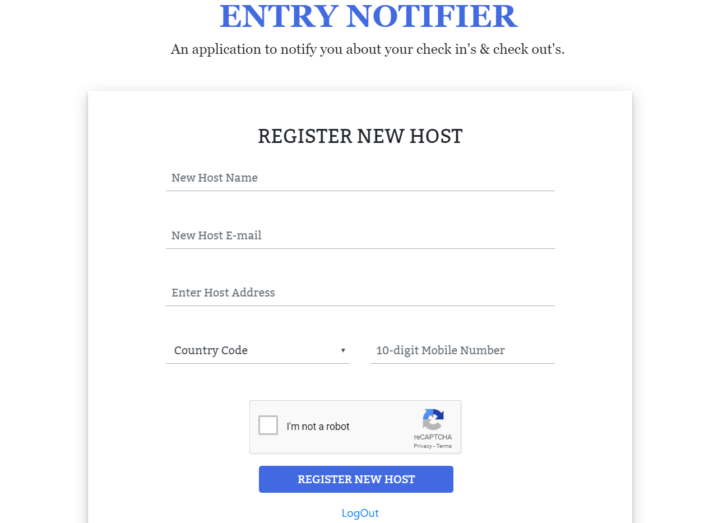

# Entry Notifier

The main motive of this venture was to create a software that can help a visitor check into an office without any kind of human intervention. The assignment aims
at automating check in's and check out's at a workplace. The user just has to specify some of his personal details like name, email and phone number and other details like who does he want to meet, his check in and check out time. 

## Pre-requisites

- Python 3.6 and pip should be preinstalled.
- Way2sms api and secret key.
- A Google email account.
- Read the [Deployment and Testing](https://github.com/Vasundharashukla/entry-notifier#deployment--testing) section carefully before usage.

## Technology Stack

- **Programming Languages**
    - Pyhton 3.6
    - JavaScript

- **Frameworks**
    - Flask 1.1.1

- **Database**
    - Firebase Realtime Database (NoSQL)

- **Frontend**
    - HTML 5
    - CSS 3
    - JavaScript
    - jQuery 3.4.1
    - Bootstrap 4

- **APIs**
    - way2sms (v1) test version for sending sms.
    - Flask_mail (0.9.1) for sending emails.

## Implementation

The application can be primarily used for the following three tasks:

- Recording Visitor Check In
- Visitor Check Out
- Registration of a new host

### Visitor Check In

As soon as the visitor opens the application a check in form appears. The visitor can check in by filling all the fields in the form. All the fields are mandatory to fill. The form is validated in the flask backend for any mistakes or null values and the check in is terminated. The user will see an alert on the check in page about what went wrong and is required to fill the form again. If all the data is correct and valid, the form is submitted and the host is informed about the check in through sms and email.

- **Check In Page Demo**


- **User Checked In Demo**


> The user has been asked to provide a checkout time in the check-in page according to the mentioned requirements. I have done a modification in this assignment using this checkout time. It might happen that a visitor checks out on the mentioned time but forgets to check out from the app. Taking into consideration this particular issue, I have created a **scheduler** that runs in the backend and executes a function at the mentioned checkout time. It checks the datbase and if the user has already checked out, the function terminates otherwise it performs the check out user and mails him notifying about the checkout. The scheduler has been implemented using APScheduler module in Python. This modification is useful because neither the host nor the visitor needs to worry if the visitor forgets to check out. It will be automatically done!


### Visitor Check Out

A seperate check out page has been created where the user is required to mention the same mobile number they entered during check in. They are also required to mention a checkout time. If all details are correct and valid, the user will be checked out and will be sent all details through sms and email otherwise he will be asked to fill the details again.

- **Check Out Page Demo**


- **User Checked Out Page**


> The visitor will be redirected to the home page, that is, the check in page as soon as the check out is successful.

### Host Registration

A workplace can have multiple hosts therefore the visitor will have the option to select who does he want to meet from a given list of all the hosts registered in the database. The registration can only be performed by one single adminstrator. The admin will have to login in order to register a new user. Without a proper sign in, no user will be able to access this page. This restriction has been created to prevent unauthorized access otherwise some other visitor or infiltrator might register multiple fake hosts that can increase the load on the database.

- **Admin Login Demo**


- **New Host Registration Page Demo**



> The new host will be informed about his registration on the application using email and sms. The details entered here will be further used at the check in window.

## The Firebase Realtime Database

[Firebase](https://console.firebase.google.com/) is a mobile and web application development platform developed by Firebase, Inc. in 2011, then acquired by Google in 2014. Anyone with a google account can use the services provided by firebase. Besides providing services like Authentication, ML Kit, Firestore, etc., Firebase also provides a realtime database. The realtime database uses REST API calls to interact with the application and can be integrated with multiple languages and frameworks. Python has a module named [python-firebase](https://ozgur.github.io/python-firebase/) to interact with the firebase console. The realtime database stores data in json format. It is a NoSQL database management system.

- **The Database**

      

> As you can see, the data is stored as key value pairs. I have made phone number to be the key for each new host as it will be unique for every user. For the user data, each consists of 3 key value pairs which store the name, email and date of visit. Each date conists of a list of key-value pairs having the details of each and every check in. A list has been made for each data for each user because it enables us to store details of multiple check ins on a single day otherwise the keys would get re-written if the user does multiple check ins on the same day. As far as the host data is concerned, it is also stored based on mobile number and has three keys to store address, email and name.

## Deployment & Testing

The application has been deployed on heroku and can be accessed [here](https://entry-recorder.herokuapp.com).

To test/run the app locally follow the steps given below.

- Clone this repository and install all the modules mentioned in requirements.txt file.

```python
$ pip install -r requirements.txt
```

- For sending emails, you need a gmail id and allow third party applications to access it. Before using it here disable your mail security [here](https://myaccount.google.com/lesssecureapps) to allow third party application access. If the application does not send mails even after this step, follow the instructions given [here](https://www.twilio.com/blog/2018/03/send-email-programmatically-with-gmail-python-and-flask.html).

- Generate a way2sms api key from any valid indian mobile numbers and paste it in the send_message() method inside app.py. The way2sms free trial account allows you
to send 25 messages. 

- Make sure the internet connection you are using allows you to access the SMTP Port otherwise it may cause smtp errors and the application might crash while sending
emails.

- Goto the application directory through the terminal, set the environment variables and run the application as follows(as done on a windows system):

```python
$ set FLASK_APP=app.py
$ set FLASK_DEBUG=1
$ flask run
```

- As soon as you execute these commands open [http://localhost:5000](http://localhost:5000) in your browser to see the application running.

- To access the admin page, enter ```adminadmin``` as the username and ```iamadmin``` as the password.

## Future Enhancements

This is only a test version of an check in entry notifier application which still has a wide scope for improvements and enhancements. Some of them include:

- AJAX can be used to check the form details in realtime.
- Functionalities can be added where the user can edit the checkout time and the hosts can see what all visitors they have attend on a given date and how many have they attended in the past.
- Creating multiple admin accounts. Rights to change the admin password and a case of forgotten passwords may also be included.

## Credits

The country phone codes have been borrowed from [this link](https://gist.github.com/Goles/3196253#gistcomment-1608494).

Created and Developed By: Vasundhara Shukla  
Contact Email: vasundharashukla98@gmail.com
